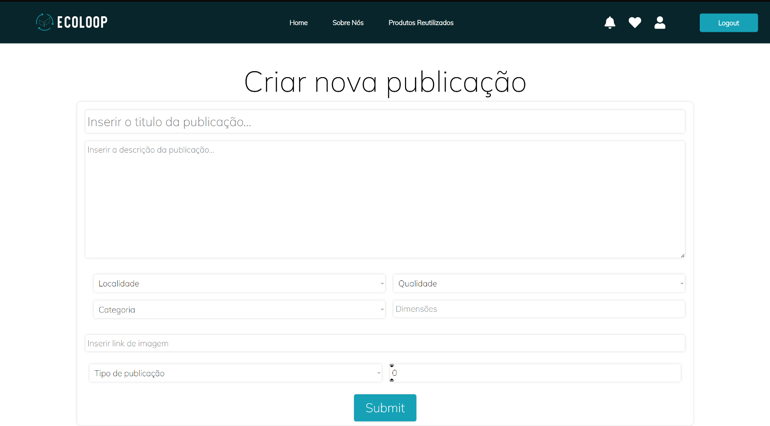
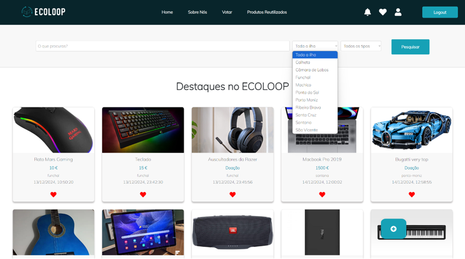
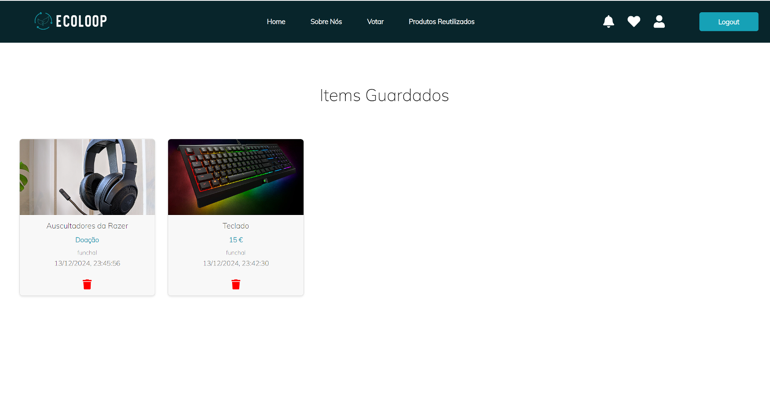

# ♻️ EcoLoop – Sustainable and Anonymous Resource Reuse Platform

> **Requirements Engineering Project – LEI 2024/2025**

**EcoLoop** is an information system developed by a team of 4 students with the goal of promoting the **reuse of physical goods** in an **anonymous**, **secure**, and **sustainable** way. It was designed in response to increasing concerns about resource waste and user privacy, enabling users to exchange, donate, or sell items without providing personal identification.

---

## 🥑 Team

This project was developed by a group of **4 students** as part of the **Requirements Engineering** course in the **Bachelor's in Computer Engineering (LEI)** at the **University of Madeira**, academic year 2024/2025.  
It received a final grade of **15/20**.

Meet the team behind the platform:

- [Milena Carreira](https://github.com/mimicarreira13)
- [Tânia Vieira](https://github.com/elisagv)
- [Leandro Hontman](https://github.com/leo152004)
- [Lúcia Pedra](https://github.com/luciacheila)

We worked together to design a system focused on sustainability, privacy, and usability. 🌍💡

---

## 🌐 Access the Prototype

You can view the live prototype here:  
👉 [https://ecoloop-vz7r.onrender.com](https://ecoloop-vz7r.onrender.com)

---

## 🚀 Main Features

- 🔒 **Guaranteed anonymity**, conceptually based on public/private key encryption
- 📦 **Item listing** with description, photo, and approximate location
- 🖘️ **Geolocated search** for items nearby, with exact location hidden until transaction is accepted
- 🪹 **Secure transactions** through unique confirmation tokens
- 🌱 **Environmental impact metrics** to track the positive effect of reuse
- ⭐ **Anonymous ratings** based on validated transactions
- 📊 **Access-controlled reports** for approved external entities

> **Note:** As this is a prototype, features such as encryption-based authentication, transaction confirmation, ratings, and blockchain integration are not implemented but conceptually outlined.

---

## 🛠️ Technologies Used

- **Frontend:** [React](https://reactjs.org/)
- **Backend & Database:** [MongoDB](https://www.mongodb.com/) with [Mongoose](https://mongoosejs.com/)

---

## ✅ Key Implemented Requirements

We focused on implementing the following key requirements:

- Automatic generation of anonymous usernames
- Restriction to one account per user (based on NIF)
- Product listing with title, category, and location
- Search functionality with filters by district
- Sorting results by geographic proximity
- Ability to save favorite posts
- Monitoring of reused item quantities
- Administrator approval flow for company accounts

Each requirement was developed based on defined acceptance criteria, ensuring clarity and consistent behavior.

---

## 🧪 Validation and Testing

Implemented features were validated against objective acceptance criteria, including:

- Unique username generation
- Required field validation in listings
- Filter and sorting logic for search results
- Persistence of favorite items

---

## 🧾 Installation Instructions

```bash
# Clone the repository
git clone git@github.com:mimicarreira13/ecoloop.git

# Install dependencies
npm install

# Start the project
npm start
```

---

## 📌 Current Status

This project is currently in a **functional prototype** phase, focusing on system requirements and concept validation. Some advanced features like rewards, cryptographic authentication, and blockchain integration are still in the planning stage or outlined only at a conceptual level.

---

## 📸 Visual Examples

Below are some UI screenshots from the developed prototype (featured in the final report):

### Item Listing Page


### Location-Based Search


### Account Area and Favorites


---

## 📄 License

This project is for educational purposes only and is not licensed for commercial use.

---

